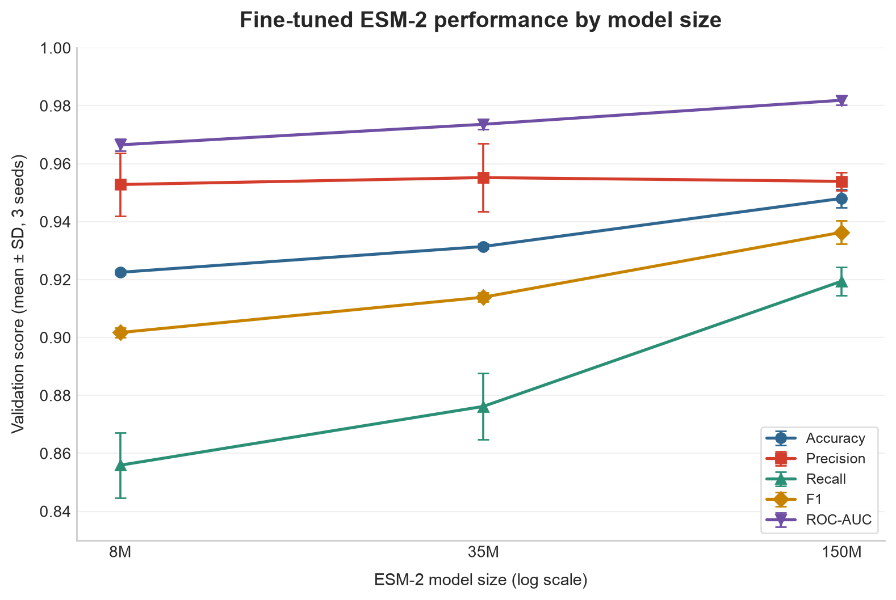
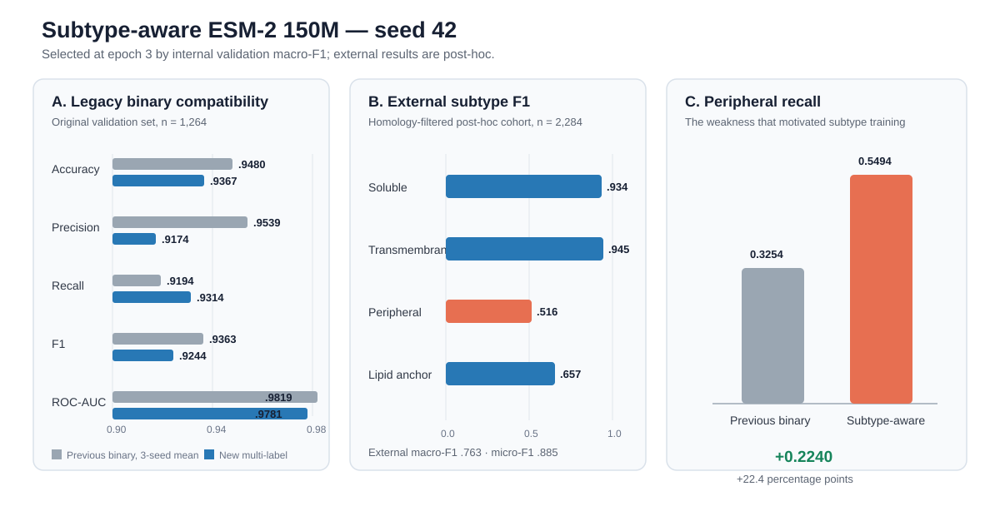

# ESM-2 Protein Localization

This project predicts whether a protein is **membrane-associated** or
**soluble** from its amino-acid sequence. V1 established the scientific
foundation: biological and classical baselines, comparison of frozen ESM-2
representations, selection of mean pooling, and an initial 8M fine-tuned model.
It also exposed the native ESM-2 limit of 1,022 amino-acid residues.

V2 is the main release. It scales frozen and fine-tuned ESM-2 from 8M to 35M
and 150M parameters, confirms the selected model across multiple seeds, tests
external generalization, investigates membrane-subtype failures, evaluates a
subtype-aware extension, supports long proteins with validated overlapping
windows, and delivers the selected model through a local FastAPI web service.

## Project status

**V1 foundation:** established hydrophobicity and classical baselines, found
mean pooling to be the strongest frozen ESM-2 representation, showed that
fine-tuning improved over frozen embeddings, and identified the 1,022-residue
native context limit.

**V2 upgrades:** selected fine-tuned ESM-2 150M by validation F1 across seeds
17, 42, and 73; achieved exploratory test F1 **0.9220** and ROC-AUC **0.9771**;
performed homology-filtered external and subtype analysis; improved Peripheral
recall in a subtype-aware pilot; validated overlapping windows for long
proteins; and built a locally validated FastAPI demo with a 40-test suite, CI,
and deployment-ready container configuration.

No public cloud endpoint is maintained. AWS configuration is an optional
reference for a future role-specific deployment. Test results remain
exploratory because the test split had already been inspected in V1.

## Version progression

```text
V1 foundation
DeepLoc binary data
  -> biological/classical baselines
  -> frozen ESM-2 representation comparison
  -> mean pooling selected
  -> initial 8M fine-tuning
  -> 1,022-residue limitation identified

V2 upgrades
8M / 35M / 150M frozen and fine-tuned comparison
  -> three-seed confirmation
  -> 150M fine-tuned model selected
  -> homology-filtered external evaluation
  -> subtype diagnosis and subtype-aware pilot
  -> validated long-protein overlapping windows
  -> FastAPI inference service and interactive web demo
```

The frozen workflow does **not** update ESM-2. It extracts one 320-dimensional
vector per protein using first-token, mean, or max pooling, then trains a
separate Logistic Regression classifier for each representation. The
fine-tuning workflow updates the ESM-2 weights and classification head jointly.

## Dataset and splits

The source data are binary membrane-versus-soluble records derived from
DeepLoc. Raw and processed data are not committed to GitHub.

| Stage | Proteins |
|---|---:|
| Initial records | 14,004 |
| ESM-compatible binary dataset | 7,890 |
| Train | 5,055 |
| Validation | 1,264 |
| Test | 1,571 |

The ESM-compatible dataset excludes duplicates and 737 proteins longer than the
model limit of 1,022 residues; sequences are not truncated. The independent
hydrophobicity baseline uses all 8,627 eligible binary proteins because it has
no transformer length limit.

The validation set is used for model comparison and checkpoint selection. The
test split was previously inspected during exploratory frozen-model analysis,
so any further result on it must be described as exploratory rather than a
fully untouched final estimate.

## Results

### V1 foundation: baseline and representation selection

This compact table is retained to show the evidence inherited by V2: mean
pooling was the strongest frozen representation and fine-tuning improved over
the frozen model. V1 is context for the upgrade, not the main result of this
release.

| Method | Representation | Accuracy | Precision | Recall | F1 | ROC-AUC |
|---|---|---:|---:|---:|---:|---:|
| Hydrophobicity + Logistic Regression | 35 handcrafted features | 0.815 | 0.788 | 0.749 | 0.768 | 0.871 |
| Hydrophobicity + Random Forest | 35 handcrafted features | 0.847 | 0.889 | 0.714 | 0.792 | 0.916 |
| Frozen ESM-2 + Logistic Regression | First token | 0.851 | 0.820 | 0.823 | 0.821 | 0.935 |
| Frozen ESM-2 + Logistic Regression | Max pooling | 0.834 | 0.805 | 0.792 | 0.798 | 0.911 |
| Frozen ESM-2 + Logistic Regression | Mean pooling | 0.892 | 0.882 | 0.853 | 0.867 | 0.948 |
| **Fine-tuned ESM-2** | **Mean pooling** | **0.922** | **0.959** | **0.848** | **0.900** | **0.969** |

Mean pooling was selected using validation F1 among the frozen representations.
Fine-tuning improved validation F1 by about **3.25 percentage points** and
ROC-AUC by about **2.08 percentage points** over frozen mean embeddings. Its
validation confusion counts were TN = 720, FP = 19, FN = 80, and TP = 445.


### V1 foundation: shared-cohort ROC comparison

For a fair visual comparison, the classical Random Forest was retrained on the
ESM-compatible training split and all three methods were evaluated on the same
1,264 validation proteins. The figure therefore differs from the full-length
classical-baseline table above, which includes longer proteins.


### V2 model scaling across three seeds

The first V2 result compared frozen mean-pooled representations and end-to-end
fine-tuning across ESM-2 8M, 35M, and 150M. Architecture selection used
validation F1. Frozen rows use mean-pooled embeddings with Logistic Regression;
fine-tuned rows report the mean across seeds 17, 42, and 73.

| ESM-2 size | Training method | Precision | Recall | F1 | ROC-AUC |
|---|---|---:|---:|---:|---:|
| 8M | Frozen | 0.8819 | 0.8533 | 0.8674 | 0.9478 |
| 8M | Fine-tuned | 0.9528 | 0.8559 | 0.9017 | 0.9665 |
| 35M | Frozen | 0.8740 | 0.8457 | 0.8596 | 0.9520 |
| 35M | Fine-tuned | 0.9552 | 0.8762 | 0.9139 | 0.9736 |
| 150M | Frozen | 0.8929 | 0.8895 | 0.8912 | 0.9623 |
| **150M** | **Fine-tuned** | **0.9539** | **0.9194** | **0.9363** | **0.9819** |

Fine-tuning improved F1 over the frozen representation at every tested size,
and the fine-tuned result improved from 8M to 35M to 150M. Fine-tuned ESM-2
150M therefore delivered the best validation performance and was selected as
the V2 architecture. The tested range does not yet demonstrate a performance
plateau.



### V2 external generalization and subtype diagnosis

The selected binary 150M model was next evaluated across the same three seeds
on a homology-filtered DeepLoc 2.1 external cohort. Performance was lower than
on the original validation set.

| Cohort | Accuracy | Precision | Recall | F1 | ROC-AUC |
|---|---:|---:|---:|---:|---:|
| Original validation | 0.9480 | 0.9539 | 0.9194 | 0.9363 | 0.9819 |
| Homology-filtered external | 0.8672 | 0.8805 | 0.7527 | 0.8116 | 0.9021 |

The recall difference should not be interpreted as a simple failure to
reproduce the original result. The original random validation split contains
many proteins with detectable training-set homologs, whereas the external
workflow removed exact overlaps and training homologs and also represents a
different DeepLoc release. These changes create a harder distribution shift.
Subtype diagnostics locate most of the missed positives more specifically:
Transmembrane recall remained **0.9521**, but Peripheral recall was only
**0.3254**, corresponding to an average of about 171 missed Peripheral proteins
out of 253 across the three seeds. LipidAnchor recall was **0.7333**. Thus, the
large overall recall decline is consistent with both stricter homology control
and a subtype-composition problem—especially poor recognition of Peripheral
proteins—rather than a uniform loss across all membrane proteins. This analysis
motivated the subtype-aware extension below, although it cannot by itself assign
all of the difference to one cause.

### V2 subtype-aware multi-label extension

The selected 150M architecture was extended from one binary output to four
independent sigmoid outputs: **Soluble**, **Transmembrane**, **Peripheral**, and
**LipidAnchor**. This allows a protein to carry more than one localization label.
The current experiment is a single pilot run with seed 42, not yet a three-seed
confirmation. Epoch 3 was selected using internal validation macro-F1.

| Internal validation label | Precision | Recall | F1 | ROC-AUC |
|---|---:|---:|---:|---:|
| Soluble | 0.9338 | 0.9424 | 0.9381 | 0.9373 |
| Transmembrane | 0.9701 | 0.9503 | 0.9601 | 0.9839 |
| Peripheral | 0.3385 | 0.4244 | 0.3766 | 0.8266 |
| LipidAnchor | 0.7621 | 0.8135 | 0.7869 | 0.9516 |

Internal exact-match accuracy was **0.8153**, micro-F1 was **0.8890**, and
macro-F1 was **0.7654**. Exact-match accuracy is deliberately strict: every
label assigned to a protein must be correct.

To check whether subtype training damaged the original task, the new checkpoint
was converted back to a binary membrane-versus-soluble prediction and evaluated
on the original 1,264-protein validation set.

| Binary validation model | Accuracy | Precision | Recall | F1 | ROC-AUC |
|---|---:|---:|---:|---:|---:|
| Previous binary 150M, seed 42 | 0.9446 | 0.9505 | 0.9143 | 0.9320 | 0.9808 |
| Previous binary 150M, 3-seed mean | 0.9480 | 0.9539 | 0.9194 | 0.9363 | 0.9819 |
| New multi-label 150M, seed 42 | 0.9367 | 0.9174 | 0.9314 | 0.9244 | 0.9781 |

Relative to the previous three-seed binary mean, the new model has lower
accuracy and F1 by about **1.13** and **1.19 percentage points**, respectively,
but higher recall by about **1.20 points**. The trade-off is primarily lower
precision rather than a loss of ranking ability; ROC-AUC remains 0.9781.

The same checkpoint was then evaluated on the existing 2,284-protein,
homology-filtered external cohort. Because this cohort motivated the subtype
extension, this is a **post-hoc diagnostic**, not an untouched final test.

| External label | Precision | Recall | F1 | ROC-AUC |
|---|---:|---:|---:|---:|
| Soluble | 0.9512 | 0.9176 | 0.9341 | 0.9315 |
| Transmembrane | 0.9576 | 0.9336 | 0.9455 | 0.9798 |
| Peripheral | 0.4860 | 0.5494 | 0.5158 | 0.8355 |
| LipidAnchor | 0.6250 | 0.6923 | 0.6569 | 0.8766 |

External exact-match accuracy was **0.7933**, micro-F1 was **0.8850**, and
macro-F1 was **0.7631**. Most importantly, Peripheral recall increased from
**0.3254 to 0.5494**—an absolute gain of **0.2240**—while Transmembrane
performance remained strong. Peripheral localization is still the main weak
class, so the result supports further data and multi-seed work rather than
claiming the problem is solved.

The gain should therefore be interpreted as evidence of learnable Peripheral
signal, not as a satisfactory endpoint. Peripheral proteins make up only about
**11.1%** of this external cohort, while the subtype-aware model achieved
precision **0.4860** and ROC-AUC **0.8355**, so its predictions are meaningfully
better than blind or prevalence-level guessing. Nevertheless, recall **0.5494**
still misses about 45% of Peripheral proteins and F1 is only **0.5158**. The
current model remains too weak for reliable Peripheral identification; this is
a promising but partial result that motivates deeper data and modeling work.



The machine-readable values used here are stored in
[`results/metrics/v2_subtype_aware_summary.json`](results/metrics/v2_subtype_aware_summary.json).

### V2 ESM-2 150M test evaluation

After architecture selection, all three existing 150M seed checkpoints were
evaluated. Values are mean ± sample standard deviation.

| Test N | Accuracy | Precision | Recall | F1 | ROC-AUC |
|---:|---:|---:|---:|---:|---:|
| 1,571 | 0.9327 ± 0.0020 | 0.9067 ± 0.0059 | 0.9379 ± 0.0023 | 0.9220 ± 0.0020 | 0.9771 ± 0.0016 |

The small standard deviations show that the result is stable across the three
training seeds. Relative to validation, test accuracy decreased by about 1.53
percentage points and F1 by about 1.43 points, while recall increased. This is
a modest generalization gap rather than evidence of severe overfitting.

Because the same official test split had already been inspected during V1,
this remains an exploratory test estimate rather than a completely untouched
final benchmark. A genuinely external or homology-controlled test set is still
needed for a strong generalization claim.

### V2 long-protein window validation

Long-protein inference was evaluated on 564 DeepLoc 2.1 proteins longer than
1,022 residues after removing exact V1 overlaps and V1 training homologs at
≥30% identity with ≥80% shorter-sequence coverage. Overlaps of 128, 256, and
511 residues were compared using seed 42; 128 achieved the highest F1 and was
then confirmed with seeds 17 and 73.

| Cohort N | Window | Overlap | Accuracy | Precision | Recall | F1 | ROC-AUC |
|---:|---:|---:|---:|---:|---:|---:|---:|
| 564 | 1,022 | **128** | 0.8522 ± 0.0228 | 0.8508 ± 0.0613 | 0.8377 ± 0.0322 | 0.8425 ± 0.0157 | 0.9202 ± 0.0095 |

The long-protein result is meaningfully weaker and more seed-sensitive than
the native-length results. In particular, false-positive rate was 0.1349 ±
0.0697, so maximum-window aggregation remains experimental rather than
equivalent to the model's native single-window inference.

## Repository structure

```text
.
├── api/                        FastAPI service and typed HTTP contract
├── configs/                    Experiment configuration
├── data/                       Local raw and processed data (Git-ignored)
├── deployment/aws/             ECS Fargate task-definition template
├── docs/                       Scientific and deployment documentation
├── scripts/
│   ├── prepare_data.py
│   ├── extract_embeddings.py
│   ├── train_embedding_classifiers.py
│   ├── train_finetune.py
│   ├── train_classical_baselines.py
│   ├── build_v2_report.py
│   └── predict.py
├── src/esm2_localization/      Reusable model and V2 reporting code
├── results/                    Metrics, figures, and local model artifacts
├── tests/                      Offline and API automated test suite
└── web/                        Interactive single-sequence demo
```

V2 is a Python-first workflow and does not depend on notebooks. The V1
walkthrough and Colab notebook remain preserved under the GitHub
[`v1.0.0` tag](https://github.com/yangmei25/esm2-protein-localization/tree/v1.0.0/notebooks).
Local exploratory notebooks are kept in the Git-ignored `notebooks_for_me/`
directory and are not included in the V2 release.

## Setup

Python 3.11.5 and the direct dependency versions in `requirements.txt` form the
verified local environment.

```bash
git clone https://github.com/yangmei25/esm2-protein-localization.git
cd esm2-protein-localization
python -m venv .venv
source .venv/bin/activate
pip install -r requirements.txt
```

Place the original DeepLoc FASTA at the path described in
[`data/raw/README.md`](data/raw/README.md). Large data, cached embeddings, and
model checkpoints should remain local and should not be committed to GitHub.

Download the fine-tuned checkpoint from the published `model-v1.0` GitHub
Release and verify its SHA-256 checksum with:

```bash
python scripts/download_checkpoint.py
```

## Reproduce the frozen-embedding workflow

```bash
python scripts/prepare_data.py
python scripts/extract_embeddings.py --device auto
python scripts/train_embedding_classifiers.py
```

Use `python <script> --help` to see paths and optional settings. Embedding
extraction can be smoke-tested first with `--limit 100`; replacing an existing
cache requires the explicit `--overwrite` flag.

## Reproduce the classical baselines

The classical workflow operates directly on the full-length raw DeepLoc FASTA,
including proteins longer than ESM-2's limit:

```bash
python scripts/train_classical_baselines.py --overwrite
```

This trains both classifiers, writes public metrics and predictions under
`results/metrics/classical_baselines/`, saves generated model files under the
Git-ignored `results/models/classical_baselines/`, and regenerates the validation
ROC figure used in this README.

## Fine-tune from Python

Run the selected ESM-2 150M architecture from a GPU-enabled Python environment.
Use separate output directories for each seed; on Colab these may point into
Google Drive so checkpoints survive runtime disconnection.

```bash
python scripts/train_finetune.py \
  --data data/processed/deeploc_binary.csv \
  --output-dir results/v2_model_scaling/finetuned/esm2_150m_seed42 \
  --model-name facebook/esm2_t30_150M_UR50D \
  --seed 42 \
  --batch-size 4 \
  --eval-batch-size 8 \
  --gradient-accumulation-steps 4 \
  --gradient-checkpointing \
  --device cuda \
  --mixed-precision auto
```

Repeat with seeds 17 and 73 for the three-seed confirmation. Test evaluation
requires an explicit choice and must not be used for further model selection:

```bash
python scripts/train_finetune.py \
  --data data/processed/deeploc_binary.csv \
  --output-dir results/v2_model_scaling/finetuned/esm2_150m_seed42 \
  --model-name facebook/esm2_t30_150M_UR50D \
  --device cuda \
  --test-only
```

Regenerate the CPU-only V2 report tables and figure with:

```bash
python scripts/build_v2_report.py
```

## FastAPI inference service and web demo

V2 includes a typed FastAPI service that loads the selected checkpoint once and
reuses it across requests. The service exposes a health endpoint, OpenAPI docs,
and an interactive browser demo.

```bash
pip install -r requirements-api.txt
export MODEL_CHECKPOINT=/absolute/path/to/esm2_150m/best_checkpoint.pt
export MODEL_DEVICE=cpu
uvicorn api.main:app --host 0.0.0.0 --port 8000
```

Open:

- `http://localhost:8000/demo` — interactive prediction demo;
- `http://localhost:8000/docs` — generated API documentation; and
- `http://localhost:8000/health` — deployment health check.

Example request:

```bash
curl -X POST http://localhost:8000/v1/predict \
  -H 'Content-Type: application/json' \
  -d '{"protein_id":"example","sequence":"MKTIIALSYIFCLVFADYKDDDDK"}'
```

Sequences longer than 1,022 residues automatically use the validated 1,022-aa
window size, 128-aa overlap, and maximum-window probability aggregation. The
endpoint returns both the protein-level prediction and window coordinates.

The container excludes model weights. A checkpoint can be mounted locally or
downloaded from a private S3 object at container startup. CI runs the offline
and API contract tests and verifies the Docker build. An optional, manually
triggered AWS workflow demonstrates GitHub OIDC, immutable ECR image tags, and
ECS task-definition revisions. It has not been used to maintain a public cloud
endpoint. See [`docs/DEPLOYMENT.md`](docs/DEPLOYMENT.md) for the reference setup.

## Predict one protein

Use the selected local checkpoint to predict a direct amino-acid sequence:

```bash
python scripts/predict.py \
  --protein-id example_protein \
  --sequence "MKTIIALSYIFCLVFADYKDDDDK" \
  --device auto
```

Alternatively, supply a single-record FASTA file:

```bash
python scripts/predict.py --fasta protein.fasta --device auto
```

The command prints JSON containing the predicted label, membrane and soluble
probabilities, sequence length, decision threshold, model, checkpoint epoch,
and device. Sequences longer than 1,022 residues are evaluated as overlapping
1,022-residue windows (validated overlap 128; stride 894). The protein probability is the
maximum window probability, and the JSON includes every window plus the
highest-scoring candidate region. This multiple-instance aggregation is an
experimental inference heuristic and is not an exact transmembrane-segment
prediction.

## Limitations

- BLASTP found training homologs at ≥30% identity and ≥80% shorter-sequence
  coverage for 55.8% of validation proteins and 13.6% of test proteins. The
  random validation split is therefore especially vulnerable to optimistic
  performance estimates.
- Proteins longer than 1,022 residues were excluded from model training and
  benchmark experiments. Windowed long-protein inference therefore requires
  a dedicated validation before production use.
- No explicit license for redistribution of the DeepLoc 1.0 dataset was
  identified, so raw data are not distributed in this repository.
- The official test split has already been used for exploratory analysis.
- V2 uses three random seeds, but three runs provide only a limited estimate of
  training variability.
- Current metrics describe this dataset only; they do not establish reliability
  on proteins from a different organism, database, or experimental protocol.
- Predictions are computational hypotheses and do not replace experimental
  localization evidence.

See [`docs/SCIENTIFIC_LIMITATIONS.md`](docs/SCIENTIFIC_LIMITATIONS.md) for the
full audit status and research-quality roadmap. Reproduce the similarity audit
with:

```bash
python scripts/audit_homology.py --overwrite
```

## Next steps

1. Add an integration test for checkpoint loading and inference.
2. Create similarity-clustered, homology-aware data splits and rerun the
   selected comparisons.
3. Confirm the subtype-aware pilot across multiple random seeds.
4. Improve long-protein calibration and compare maximum probability with
   length-normalized or top-k bag-level aggregation.
