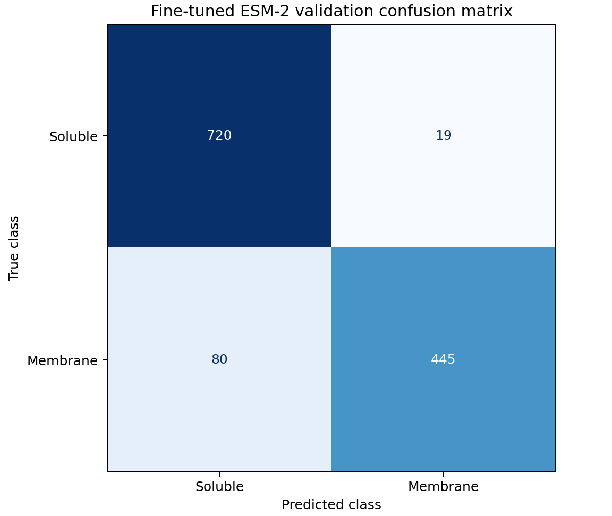
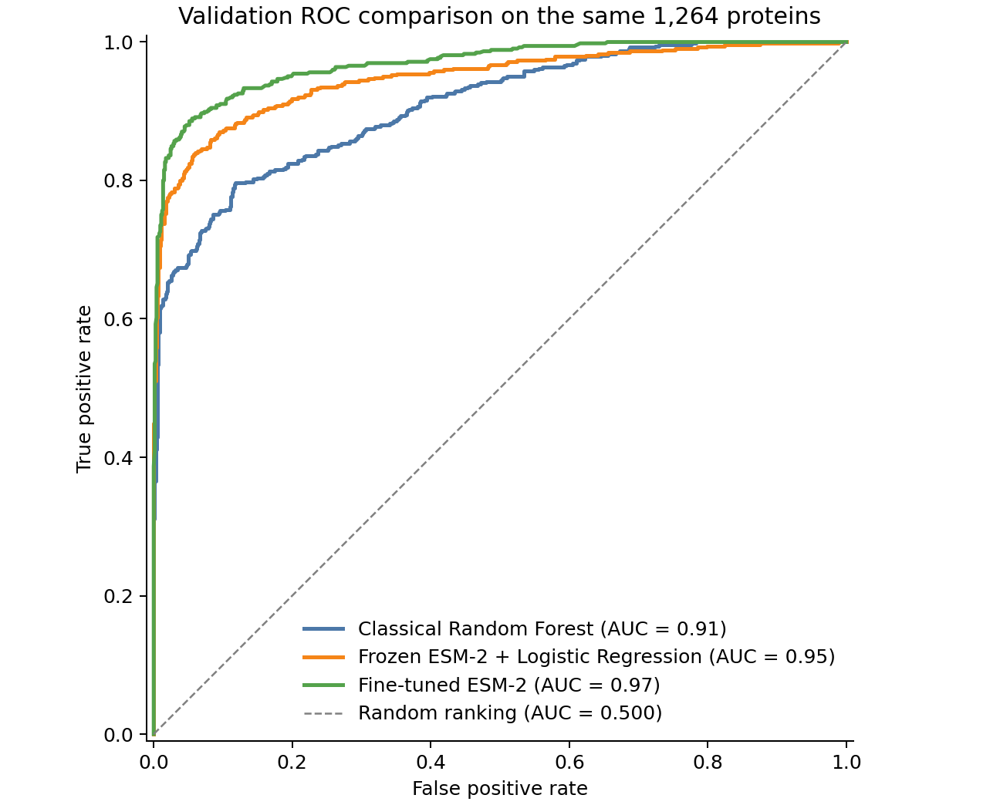

# ESM-2 Protein Localization

This project predicts whether a protein is **membrane-associated** or
**soluble** from its amino-acid sequence. It compares an interpretable
hydrophobicity baseline with two uses of the small
[`facebook/esm2_t6_8M_UR50D`](https://huggingface.co/facebook/esm2_t6_8M_UR50D)
protein language model:

1. frozen ESM-2 embeddings followed by Logistic Regression; and
2. end-to-end fine-tuning of ESM-2 with a binary classification head.

The 8M-parameter model was chosen deliberately: it is practical on a single
consumer GPU or Google Colab while still providing learned protein-sequence
representations.

## Project status

The data pipeline, three frozen-embedding experiments, biological baselines,
and validation-stage fine-tuning are complete. The best current validation
result is the fine-tuned ESM-2 model with **0.900 F1** and **0.969 ROC-AUC**.

Single-sequence inference, a 24-test offline suite, reproducible classical
baselines, and a pinned Python environment are complete. Remaining work includes
documenting dataset provenance more completely, adding an end-to-end checkpoint
integration test, and evaluating with a homology-aware split. Fine-tuned test
evaluation is reported as exploratory because the test split had already been
inspected earlier in the project.

## Pipeline

```text
DeepLoc protein sequences
          |
          v
Cleaning, deduplication, binary labels, fixed splits
          |
          +------------------------------+
          |                              |
          v                              v
Hydrophobicity/composition        ESM-2 8M (<=1,022 residues)
features                          |
          |                       +-----------------------+
          v                       |                       |
Logistic Regression /             v                       v
Random Forest              frozen embeddings       end-to-end fine-tuning
                           (first, mean, max)              |
                                  |                       |
                                  v                       v
                           Logistic Regression       classification head
```

The frozen workflow does **not** update ESM-2. It extracts one 320-dimensional
vector per protein using first-token, mean, or max pooling, then trains a
separate Logistic Regression classifier for each representation. The
fine-tuning workflow updates the ESM-2 weights and classification head jointly.

## Dataset and splits

The source data are binary membrane-versus-soluble records derived from
DeepLoc. Raw and processed data are not committed to GitHub.

| Stage | Proteins |
|---|---:|
| Initial records | 14,004 |
| ESM-compatible binary dataset | 7,890 |
| Train | 5,055 |
| Validation | 1,264 |
| Test | 1,571 |

The ESM-compatible dataset excludes duplicates and 737 proteins longer than the
model limit of 1,022 residues; sequences are not truncated. The independent
hydrophobicity baseline uses all 8,627 eligible binary proteins because it has
no transformer length limit.

The validation set is used for model comparison and checkpoint selection. The
test split was previously inspected during exploratory frozen-model analysis,
so any further result on it must be described as exploratory rather than a
fully untouched final estimate.

## Results

### Validation comparison

| Method | Representation | Accuracy | Precision | Recall | F1 | ROC-AUC |
|---|---|---:|---:|---:|---:|---:|
| Hydrophobicity + Logistic Regression | 35 handcrafted features | 0.815 | 0.788 | 0.749 | 0.768 | 0.871 |
| Hydrophobicity + Random Forest | 35 handcrafted features | 0.847 | 0.889 | 0.714 | 0.792 | 0.916 |
| Frozen ESM-2 + Logistic Regression | First token | 0.851 | 0.820 | 0.823 | 0.821 | 0.935 |
| Frozen ESM-2 + Logistic Regression | Max pooling | 0.834 | 0.805 | 0.792 | 0.798 | 0.911 |
| Frozen ESM-2 + Logistic Regression | Mean pooling | 0.892 | 0.882 | 0.853 | 0.867 | 0.948 |
| **Fine-tuned ESM-2** | **Mean pooling** | **0.922** | **0.959** | **0.848** | **0.900** | **0.969** |

Mean pooling was selected using validation F1 among the frozen representations.
Fine-tuning improved validation F1 by about **3.25 percentage points** and
ROC-AUC by about **2.08 percentage points** over frozen mean embeddings. Its
validation confusion counts were TN = 720, FP = 19, FN = 80, and TP = 445.



### ROC comparison on a shared validation cohort

For a fair visual comparison, the classical Random Forest was retrained on the
ESM-compatible training split and all three methods were evaluated on the same
1,264 validation proteins. The figure therefore differs from the full-length
classical-baseline table above, which includes longer proteins.



### Exploratory fine-tuned test result

| Test N | Accuracy | Precision | Recall | F1 | ROC-AUC |
|---:|---:|---:|---:|---:|---:|
| 1,571 | 0.916 | 0.921 | 0.877 | 0.898 | 0.961 |

At threshold 0.5, the test confusion counts were TN = 855, FP = 50, FN = 82,
and TP = 584. These sum to all 1,571 test proteins. The result is encouragingly
close to validation performance, but it is not a fully untouched final estimate.

## Repository structure

```text
.
├── configs/                    Experiment configuration
├── data/                       Local raw and processed data (Git-ignored)
├── notebooks/
│   ├── 01_project_walkthrough.ipynb
│   └── 02_colab_finetuning.ipynb
├── scripts/
│   ├── prepare_data.py
│   ├── extract_embeddings.py
│   ├── train_embedding_classifiers.py
│   ├── train_finetune.py
│   ├── train_classical_baselines.py
│   └── predict.py
├── src/esm2_localization/      Reusable package code
├── results/                    Metrics, figures, and local model artifacts
└── tests/                      Offline automated test suite
```

The public notebooks provide a high-level walkthrough and a Colab fine-tuning
workflow. Detailed learning notebooks are kept locally in the Git-ignored
`notebooks_for_me/` directory. Command-line scripts are the authoritative
implementation.

## Setup

Python 3.11.5 and the direct dependency versions in `requirements.txt` form the
verified local environment.

```bash
git clone https://github.com/yangmei25/esm2-protein-localization.git
cd esm2-protein-localization
python -m venv .venv
source .venv/bin/activate
pip install -r requirements.txt
```

Place the original DeepLoc FASTA at the path described in
[`data/raw/README.md`](data/raw/README.md). Large data, cached embeddings, and
model checkpoints should remain local and should not be committed to GitHub.

Download the fine-tuned checkpoint from the published `model-v1.0` GitHub
Release and verify its SHA-256 checksum with:

```bash
python scripts/download_checkpoint.py
```

## Reproduce the frozen-embedding workflow

```bash
python scripts/prepare_data.py
python scripts/extract_embeddings.py --device auto
python scripts/train_embedding_classifiers.py
```

Use `python <script> --help` to see paths and optional settings. Embedding
extraction can be smoke-tested first with `--limit 100`; replacing an existing
cache requires the explicit `--overwrite` flag.

## Reproduce the classical baselines

The classical workflow operates directly on the full-length raw DeepLoc FASTA,
including proteins longer than ESM-2's limit:

```bash
python scripts/train_classical_baselines.py --overwrite
```

This trains both classifiers, writes public metrics and predictions under
`results/metrics/classical_baselines/`, saves generated model files under the
Git-ignored `results/models/classical_baselines/`, and regenerates the validation
ROC figure used in this README.

## Fine-tune in Google Colab

Open [`notebooks/02_colab_finetuning.ipynb`](notebooks/02_colab_finetuning.ipynb)
in Colab and run it from top to bottom. The notebook:

- clones this repository from GitHub;
- installs the required packages;
- reads the Git-ignored processed CSV supplied by the user;
- trains ESM-2 8M on a GPU; and
- stores checkpoints and metrics in Google Drive so they survive a Colab
  runtime reset.

The equivalent command-line entry point is:

```bash
python scripts/train_finetune.py \
  --data data/processed/deeploc_binary.csv \
  --output-dir results/finetune/esm2_t6_8M_mean \
  --device auto
```

Test evaluation requires an explicit choice. After training, an exploratory
test-only run can be made with:

```bash
python scripts/train_finetune.py \
  --data data/processed/deeploc_binary.csv \
  --output-dir results/finetune/esm2_t6_8M_mean \
  --device auto \
  --test-only
```

## Predict one protein

Use the selected local checkpoint to predict a direct amino-acid sequence:

```bash
python scripts/predict.py \
  --protein-id example_protein \
  --sequence "MKTIIALSYIFCLVFADYKDDDDK" \
  --device auto
```

Alternatively, supply a single-record FASTA file:

```bash
python scripts/predict.py --fasta protein.fasta --device auto
```

The command prints JSON containing the predicted label, membrane and soluble
probabilities, sequence length, decision threshold, model, checkpoint epoch,
and device. Sequences longer than 1,022 residues are rejected rather than
silently truncated.

## Limitations

- BLASTP found training homologs at ≥30% identity and ≥80% shorter-sequence
  coverage for 55.8% of validation proteins and 13.6% of test proteins. The
  random validation split is therefore especially vulnerable to optimistic
  performance estimates.
- Proteins longer than 1,022 residues are excluded from ESM-2 experiments.
- No explicit license for redistribution of the DeepLoc 1.0 dataset was
  identified, so raw data are not distributed in this repository.
- The official test split has already been used for exploratory analysis.
- Fine-tuning currently uses one random seed; run multiple complete training
  seeds before claiming that the measured improvement is stable.
- Current metrics describe this dataset only; they do not establish reliability
  on proteins from a different organism, database, or experimental protocol.
- Predictions are computational hypotheses and do not replace experimental
  localization evidence.

See [`docs/SCIENTIFIC_LIMITATIONS.md`](docs/SCIENTIFIC_LIMITATIONS.md) for the
full audit status and research-quality roadmap. Reproduce the similarity audit
with:

```bash
python scripts/audit_homology.py --overwrite
```

## Next steps

1. Add an integration test for checkpoint loading and inference.
2. Repeat fine-tuning with multiple random seeds and report mean ± standard
   deviation.
3. Create similarity-clustered, homology-aware data splits and rerun all models.
4. Evaluate the selected model on a genuinely external dataset.
